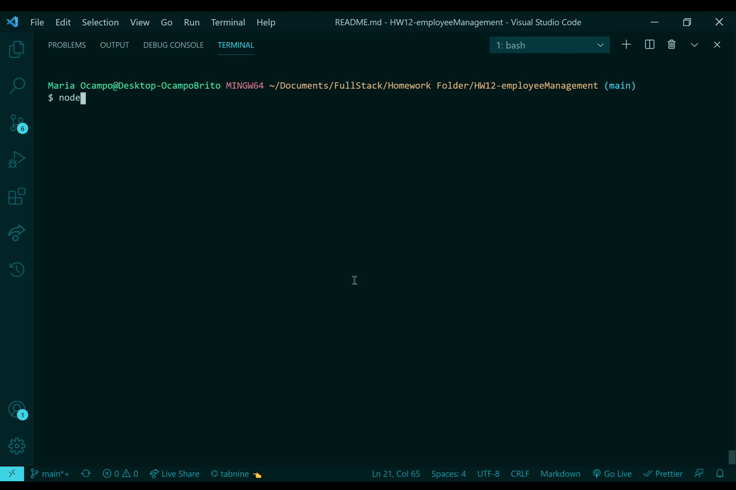

# Employee-Management-System

## Table of Contents
- [Description](#description)
- [Installation](#installation)
- [Usage](#usage)
- [License](#license)
- [Badges](#badges)
- [Features](#features)
- [Contributing](#contributing)

## Description

This is a command-line Content Management System (CMS) application that allows for easy interaction with employee information stored in a database.
The goal was to create an application that allows for adding, viewing, and updating departments, roles, and employees into a database.

I designed the database schema that contains three tables (employee, role, and department). Technologies used to develop the CSM include Node, Inquire, and MySQL.

A challenge that arose was working with foreign keys and joining the tables based on the foreign keys. To overcome this, I went over the MySQL documentation and fixed the bugs encountered because of the knowledge gap.

## Installation
In order to install this Content Management System, users can clone this repo and then run npm install on their local console.

Once installed locally, users will need to run "node employeeTracker.js" on their local console and this will prompt them with questions regarding the database.

## Usage

Here is an example on how to use the Content Management System:

## License
Licensed under the MIT license.

## Badges

## Contributing
To contribute to this application you are welcomed to create a pull request or email at mariaocampo0513@gmail.com for more questions.

---
Copyright &copy; 2020 Maria Ocampo. All Rights Reserved.
